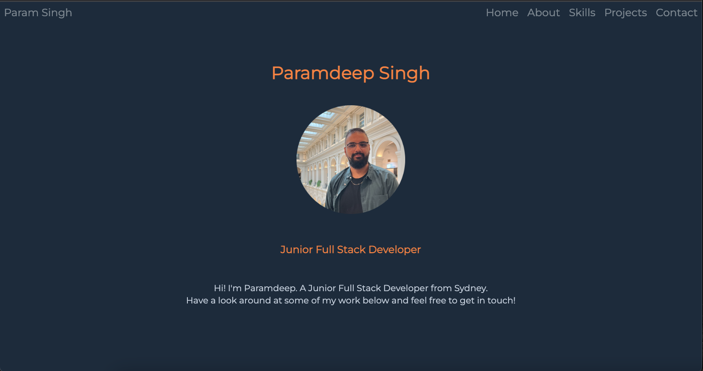

# Portfolio

- A Portfolio created to implement the skills I've learnt and create a platform to host my projects.

## Images

## Link to Deployed Version
 [Deployed Version](https://paramsingh1.github.io/portfolio/)

## Description of project (spec / MVP)
- The portfolio is built using HTML5 and SCSS to showcase the projects I have produced.
- The portfolio is split into sections which will be updated with projects I build upon.

## Approach
  - The Portfolio is built using SCSS while intergrating the BEM naming convention.
  - BEM was used for class name structuring to ensure SCSS styling is easy to maintain and build upon.

## Reflection
- One of the challenges I faced was with responsive design whereby i was required to restructure a lot of my code. After looking into the issue I discovered the concept of mobile first design, which i will be taking into consideration when working on future projects.
- I also faced an issue where my SCSS Stylesheet was hard to maintain and work upon. I then adopted the BEM naming convention alongside SCSS mixins and variables through @use and @include. This is another concept i will be taking on board for future projects.

## Future Goals
The below features are to be added:
- Hamburger menu using JS
- Improve theme layout
- Convert to React
- Aim to dynamically pull projects using GitHub API.

## Further reading and links to inspiration
- [BEM](https://getbem.com/naming/)
- [SCSS Mixins](https://sass-lang.com/documentation/at-rules/mixin)

### Stay in touch
[Linkedin](https://www.linkedin.com/in/paramsinghau/)

